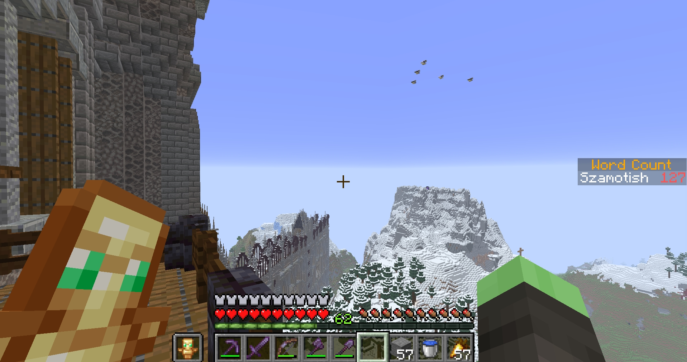
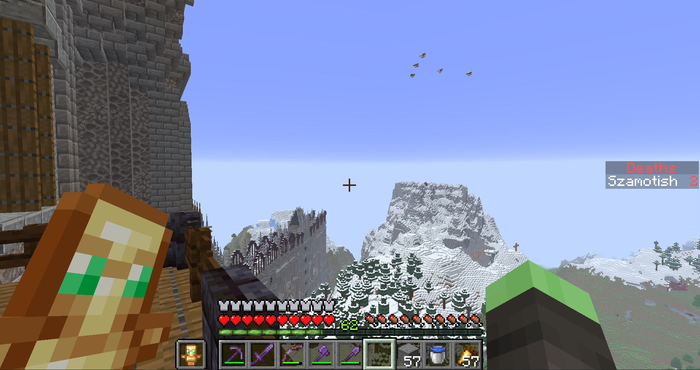

# WordCounter 3.1.0 Plugin

## Features
- Count custom words said in chat
- Per-player scoreboards
- Death tracking scoreboard
- Cooldowns and per-message limits
- Fully configurable in config.yml
- Admin commands with tab completion

## Commands
/wordcount 
Shows how many tracked words you have said
/wordcounter <reload|getcooldown|setcooldown|addword|removeword|setmaxwords|reset|setscore>
Admin tools for setting up the plugin
/show <words|deaths|off>
Changes the displayed scoreboard from wordcounter to deathcounter and turns off both scoreboards

## Installation
1. Download the jar from releases
2. Place it in `plugins/`
3. Restart server
4. Edit config.yml

## Dependencies

- **Java**: 21
- **PaperMC API**: 1.21.10-R0.1-SNAPSHOT
- Maven handles dependencies via `pom.xml`

## Build
mvn clean package

## Screenshots
 

